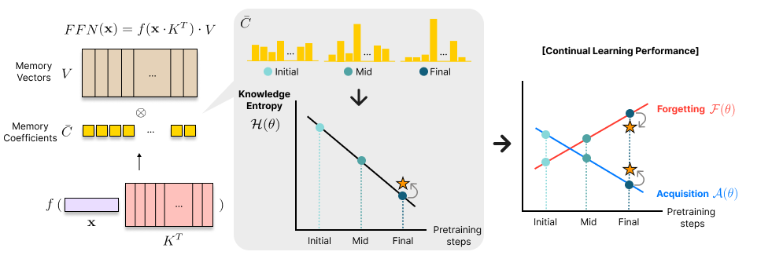

# Knowledge Entropy Decay during Language Model Pretraining Hinders New Knowledge Acquisition

This repository contains the implementation of [**Knowledge Entropy Decay during Language Model Pretraining Hinders New Knowledge Acquisition**](https://arxiv.org/abs/2410.01380). 





The code is based on the [OLMo](https://github.com/allenai/OLMo) project, with modifications to support knowledge injection during training and additional evaluations.
Knowledge injection code is based on the [factual-knowledge-acquisition](https://github.com/kaistAI/factual-knowledge-acquisition.git) project, with minor modifications for data split of 'Paraphrase or Once' and evaluations.


## Key Differences from Original OLMo Repository

1. Modified `olmo/train.py` to:
   - Apply knowledge injection during training
2. Modified `olmo/checkpoint.py` to load model checkpoint from resuscitation method
3. Added calculation of Knowledge Entropy for pretrained model in `analysis/` folder
4. Added modification of model checkpoints for resuscitation method in `analysis/` folder

## Key Differences from Original factual-knowledge-acquisition Repository
1. Augmented the number of Paraphrase data with the method introduced in the original paper [How Do Large Language Models Acquire Factual Knowledge During Pretraining?](https://arxiv.org/abs/2406.11813) using GPT4, which can be found at `fictional_knowledge/` folder
    - Original Fictional Knowledge dataset can be found at: https://huggingface.co/datasets/kaist-ai/fictional-knowledge
2. Modified evaluation code


## Installation

1. Create a conda environment with python>=3.9.
```
conda create -n knowledge-entropy python=3.11 -y
conda activate knowledge-entropy
```

2. Install packages.
```
pip install -e .
```

3. Download the intermediate OLMo checkpoint. 
Example of downloading from the official repository is presented in `scripts/get_model.sh`.
First you have to figure out the link to the proper checkpoint in the [official link](https://github.com/allenai/OLMo/blob/main/checkpoints/official/OLMo-1B.csv)
Below is example command for downloading the model whose pretraining step is 738020.

```
bash scripts/get_model.sh https://olmo-checkpoints.org/ai2-llm/olmo-small/oupb6jak/step738020-unsharded/
```


## Knowledge Entropy
1. Download official training order of Dolma from [official link](https://olmo-checkpoints.org/ai2-llm/olmo-small/46zc5fly/train_data/global_indices.npy)

```
bash scripts/get_dataorder.sh
```

2. Run Knowledge entropy calculation command, where step, data_size and batch size should be chosed appropriately.
```
python -m analysis.entropy --step 738020 --data_size 2048 --batch_size 4
```

## Training
Train OLMo model with modified config.
You can find exmaplary config at `configs/1B/1B_bs128_lr4e4_pubmed_1ep_738k.yaml`.


```
CUDA_VISIBLE_DEVICES=0,1,2,3 torchrun --nproc_per_node=4 --master_port=29599 -m scripts.train configs/1B/1B_bs128_lr4e4_pubmed_1ep_738k.yaml 
```

## Resuscitation
1. Save modified model chekpoint.
Run modifying and saving model checkpoint for resuscitation method.
Below is examplary command for changing with resuscitation ratio of 50% and amplifying factor of 2. 

```
python -m analysis.change_parameters --step 738020--resuscitation_ratio 0.5 --amplifying_factor 2
```

2. Run training command with modified config. 
The name of the newly saved model should be specified at model.resuscitation.
You can find exmaplary config at `configs/resuscitation/1B_bs128_lr4e4_pubmed_1ep_738k_resuscitation.yaml`.

```
CUDA_VISIBLE_DEVICES=0,1,2,3 torchrun --nproc_per_node=4 --master_port=29599 -m scripts.train configs/resuscitation/1B_bs128_lr4e4_pubmed_1ep_738k_resuscitation.yaml
```


## Citation
If you find our work helpful for your work, please consider citing our paper, original OLMo paper and factual-knowledge-acquisition paper
```bibtex
@inproceedings{Kim2024KnowledgeED,
  title={Knowledge Entropy Decay during Language Model Pretraining Hinders New Knowledge Acquisition},
  author={Jiyeon Kim and Hyunji Lee and Hyowon Cho and Joel Jang and Hyeonbin Hwang and Seungpil Won and Youbin Ahn and Dohaeng Lee and Minjoon Seo},
  year={2024},
  url={https://api.semanticscholar.org/CorpusID:273025776}
}
@inproceedings{groeneveld-etal-2024-olmo,
    title = "{OLM}o: Accelerating the Science of Language Models",
    author = "Groeneveld, Dirk  and
      Beltagy, Iz  and
      Walsh, Evan  and
      Bhagia, Akshita  and
      Kinney, Rodney  and
      Tafjord, Oyvind  and
      Jha, Ananya  and
      Ivison, Hamish  and
      Magnusson, Ian  and
      Wang, Yizhong  and
      Arora, Shane  and
      Atkinson, David  and
      Authur, Russell  and
      Chandu, Khyathi  and
      Cohan, Arman  and
      Dumas, Jennifer  and
      Elazar, Yanai  and
      Gu, Yuling  and
      Hessel, Jack  and
      Khot, Tushar  and
      Merrill, William  and
      Morrison, Jacob  and
      Muennighoff, Niklas  and
      Naik, Aakanksha  and
      Nam, Crystal  and
      Peters, Matthew  and
      Pyatkin, Valentina  and
      Ravichander, Abhilasha  and
      Schwenk, Dustin  and
      Shah, Saurabh  and
      Smith, William  and
      Strubell, Emma  and
      Subramani, Nishant  and
      Wortsman, Mitchell  and
      Dasigi, Pradeep  and
      Lambert, Nathan  and
      Richardson, Kyle  and
      Zettlemoyer, Luke  and
      Dodge, Jesse  and
      Lo, Kyle  and
      Soldaini, Luca  and
      Smith, Noah  and
      Hajishirzi, Hannaneh",
    editor = "Ku, Lun-Wei  and
      Martins, Andre  and
      Srikumar, Vivek",
    booktitle = "Proceedings of the 62nd Annual Meeting of the Association for Computational Linguistics (Volume 1: Long Papers)",
    month = aug,
    year = "2024",
    address = "Bangkok, Thailand",
    publisher = "Association for Computational Linguistics",
    url = "https://aclanthology.org/2024.acl-long.841",
    doi = "10.18653/v1/2024.acl-long.841",
    pages = "15789--15809",
    abstract = "Language models (LMs) have become ubiquitous in both NLP research and in commercial product offerings. As their commercial importance has surged, the most powerful models have become closed off, gated behind proprietary interfaces, with important details of their training data, architectures, and development undisclosed. Given the importance of these details in scientifically studying these models, including their biases and potential risks, we believe it is essential for the research community to have access to powerful, truly open LMs. To this end, we have built OLMo, a competitive, truly Open Language Model, to enable the scientific study of language models. Unlike most prior efforts that have only released model weights and inference code, we release OLMo alongside open training data and training and evaluation code. We hope this release will empower the open research community and inspire a new wave of innovation.",
}
@article{chang2024large,
  title={How Do Large Language Models Acquire Factual Knowledge During Pretraining?},
  author={Chang, Hoyeon and Park, Jinho and Ye, Seonghyeon and Yang, Sohee and Seo, Youngkyung and Chang, Du-Seong and Seo, Minjoon},
  journal={arXiv preprint arXiv:2406.11813},
  year={2024}
}

```


## License

Apache 2.0